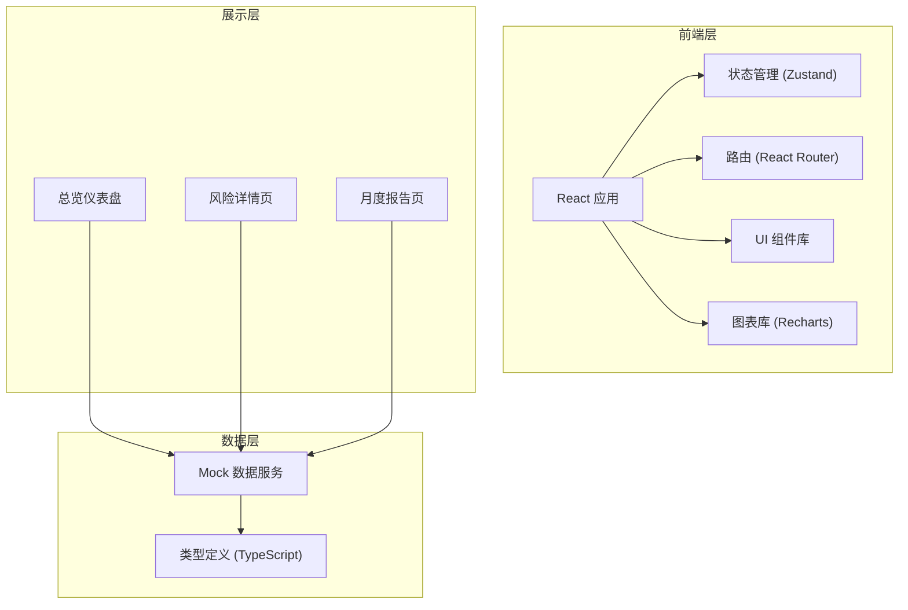

## 1. 架构设计



## 2. 技术描述

- **前端框架**：React@18 + TypeScript
- **构建工具**：Vite@5
- **样式方案**：TailwindCSS@3
- **状态管理**：Zustand
- **路由管理**：react-router-dom@6
- **图表库**：Recharts
- **图标库**：lucide-react
- **数据方案**：前端 Mock 数据（模拟真实业务场景）
- **初始化工具**：vite-init

## 3. 路由定义

| 路由 | 页面 | 功能说明 |
|------|------|----------|
| /dashboard | 总览仪表盘 | 核心指标、趋势分析、风险排行、待办事项 |
| /risk/:departmentId | 风险详情页 | 部门文件夹列表、风险钻取、整改操作 |
| /report | 月度报告页 | 月度数据汇总、治理成效、反复问题 |

## 4. 数据模型

### 4.1 核心数据类型

```typescript
// 风险等级
type RiskLevel = 'high' | 'medium' | 'low';

// 整改状态
type RemediationStatus = 'pending' | 'in_progress' | 'completed' | 'overdue';

// 共享文件夹
interface SharedFolder {
  id: string;
  name: string;
  path: string;
  departmentId: string;
  departmentName: string;
  projectName: string;
  owner: string;
  ownerEmail: string;
  riskLevel: RiskLevel;
  riskReasons: RiskReason[];
  externalLinks: number;
  externalAccounts: number;
  isPublicEditable: boolean;
  firstDiscoveredAt: string;
  lastReviewedAt: string | null;
  nextReviewDue: string;
  remediationHistory: RemediationRecord[];
  currentTask: RemediationTask | null;
}

// 风险原因
interface RiskReason {
  id: string;
  type: 'external_link' | 'external_account' | 'public_edit' | 'overdue_review' | 'excessive_permission';
  description: string;
  severity: RiskLevel;
  discoveredAt: string;
}

// 整改记录
interface RemediationRecord {
  id: string;
  action: string;
  operator: string;
  operatedAt: string;
  remark: string;
}

// 整改任务
interface RemediationTask {
  id: string;
  folderId: string;
  assignee: string;
  assigneeEmail: string;
  assigner: string;
  assignedAt: string;
  dueDate: string;
  status: RemediationStatus;
  completedAt: string | null;
  remark: string;
}

// 部门信息
interface Department {
  id: string;
  name: string;
  totalFolders: number;
  highRiskCount: number;
  mediumRiskCount: number;
  lowRiskCount: number;
  overdueCount: number;
  remediationRate: number;
}

// 趋势数据点
interface TrendDataPoint {
  date: string;
  newRisks: number;
  closedRisks: number;
  totalRisks: number;
}

// 月度报告
interface MonthlyReport {
  month: string;
  newRisks: number;
  closedRisks: number;
  totalRisks: number;
  avgResolutionDays: number;
  recurrenceRate: number;
  topRecurringIssues: RecurringIssue[];
  departmentRankings: DepartmentRanking[];
}

// 反复问题
interface RecurringIssue {
  id: string;
  description: string;
  occurrenceCount: number;
  lastOccurrence: string;
  affectedDepartments: string[];
}

// 部门排行
interface DepartmentRanking {
  departmentId: string;
  departmentName: string;
  score: number;
  improvement: number;
}
```

### 4.2 数据结构设计

- 文件夹为核心实体，关联部门、项目、负责人等维度
- 风险原因采用多对一结构，一个文件夹可包含多个风险项
- 整改记录采用时间线方式存储，支持追溯完整历史
- 趋势数据按天聚合，支持多维度时间范围筛选

## 5. 项目结构

```
src/
├── components/          # 可复用组件
│   ├── dashboard/       # 仪表盘相关组件
│   │   ├── MetricCard.tsx
│   │   ├── TrendChart.tsx
│   │   ├── RiskRanking.tsx
│   │   └── TodoList.tsx
│   ├── risk/            # 风险相关组件
│   │   ├── FolderTable.tsx
│   │   ├── RiskDetailDrawer.tsx
│   │   └── RemediationForm.tsx
│   ├── report/          # 报告相关组件
│   │   ├── SummaryCards.tsx
│   │   └── RecurringIssues.tsx
│   └── common/          # 通用组件
│       ├── Header.tsx
│       ├── Sidebar.tsx
│       ├── RiskBadge.tsx
│       └── StatusBadge.tsx
├── pages/               # 页面组件
│   ├── Dashboard.tsx
│   ├── RiskDetail.tsx
│   └── MonthlyReport.tsx
├── store/               # 状态管理
│   └── useAuditStore.ts
├── data/                # Mock 数据
│   ├── folders.ts
│   ├── departments.ts
│   ├── trends.ts
│   └── report.ts
├── types/               # 类型定义
│   └── index.ts
├── utils/               # 工具函数
│   ├── date.ts
│   └── format.ts
├── App.tsx
├── main.tsx
└── index.css
```

## 6. 关键技术决策

### 6.1 状态管理方案
- 使用 Zustand 进行全局状态管理
- 按领域划分 store：审计数据、UI 状态、筛选条件
- 支持数据缓存和部分更新，减少不必要的重渲染

### 6.2 图表方案
- 使用 Recharts 作为图表库，与 React 生态集成良好
- 封装通用图表组件，统一样式和交互
- 支持响应式自适应，不同屏幕尺寸下自动调整

### 6.3 交互设计
- 风险下钻采用侧边抽屉形式，保持上下文不丢失
- 数据加载使用骨架屏和平滑过渡动画
- 悬停态、点击反馈等微交互增强使用体验

### 6.4 性能优化
- 列表虚拟化（长列表场景）
- 图表数据按需加载
- 组件 memo 化减少不必要重渲染
- 使用 React.lazy 进行路由级代码分割
